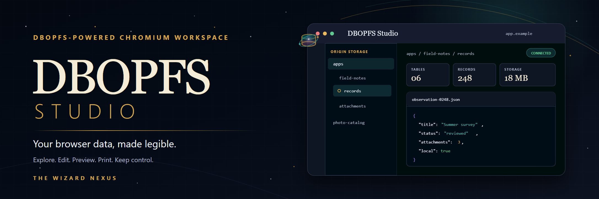
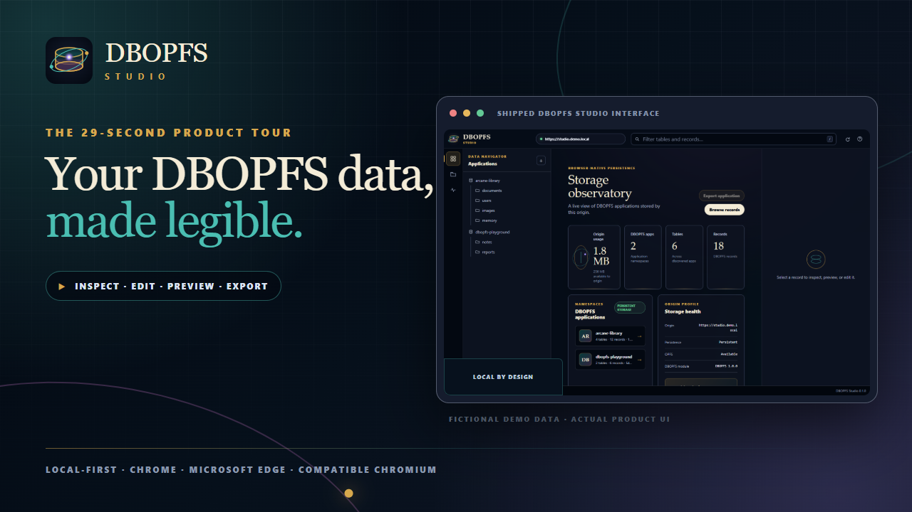

[](https://thewizardnexus.github.io/DBOPFS-Studio/)

# DBOPFS Studio

[](https://github.com/TheWizardNexus/DBOPFS-Studio/actions/workflows/ci.yml)
[](https://github.com/TheWizardNexus/DBOPFS-Studio/actions/workflows/pages.yml)
[](extension/manifest.json)
[](LICENSE)

DBOPFS Studio is a DBOPFS-powered workspace for exploring, editing, previewing,
printing, and managing DBOPFS application data stored in the Origin Private
File System in Chrome, Microsoft Edge, Brave, Vivaldi, Opera, and other
compatible Chromium browsers.

**Local-first ownership.** DBOPFS Studio runs locally in the browser and
requires no DBOPFS Studio cloud account. For commercial use, the initial
license purchase is one-time: there is no monthly subscription or mandatory
recurring DBOPFS Studio license fee for the purchased version. Optional
support, future major-version upgrades, and third-party services may have
separate costs.

The extension treats the bundled [DBOPFS](https://github.com/TheWizardNexus/DBOPFS)
module as its primary data layer. DBOPFS application folders, tables, and
records receive first-class navigation and editing tools.

[Open the product site](https://thewizardnexus.github.io/DBOPFS-Studio/) ·
[Install an unpacked build](https://thewizardnexus.github.io/DBOPFS-Studio/install.html) ·
[Review the architecture](https://thewizardnexus.github.io/DBOPFS-Studio/architecture.html) ·
[Read the privacy policy](https://thewizardnexus.github.io/DBOPFS-Studio/privacy.html)

## Promo video

[](https://youtu.be/y8FlLBzy-RU)

[Watch on YouTube](https://youtu.be/y8FlLBzy-RU) ·
[Download the 1080p MP4](promo-video/dbopfs-studio-promo-1080p.mp4) ·
[Copy the YouTube title, description, and tags](promo-video/youtube-copy.md)

The rebuildable renderer uses the shipped demonstration interface and tracked
store artwork, then adds clean cross-fades and the supplied retro jingle with
FFmpeg. Run `npm run promo:video` to rebuild the video, poster, and thumbnail.

## What it is built for

- Inspect DBOPFS applications, tables, and records as database concepts instead
  of an unexplained folder tree.
- Review origin usage, quota, persistence state, and the discovered DBOPFS
  application/table/record totals.
- Create tables and records, import files into a table, export an application,
  and delete records with exact-name confirmation.
- Edit and save supported text-based records inline, including JSON validation.
- Preview browser-supported images, audio, video, and text-based records.
- Switch between exact source and a read-only viewer for text records. Markdown
  renders through a local DOM-only renderer, while JSON and JavaScript receive
  non-destructive formatted views.
- Open PDFs in the Chromium browser's native PDF experience for viewing and
  printing. DBOPFS Studio does not bundle a PDF rendering library; the exact
  annotation and editing tools depend on the browser build.
- Print text, JSON, Markdown, and image records through the Studio print view.
  Audio and video can be previewed but do not receive a printable Studio
  rendering.
- Review storage use, quota, persistence state, and connection status for the
  active or inspected origin.

## Roadmap

The 0.1 interface is deliberately DBOPFS-first. Raw OPFS browsing for data
outside DBOPFS application namespaces, along with rename, move, and copy
commands, is planned work and is not exposed in the current Studio UI.

## Install from source

1. Clone or download this repository.
2. Open the browser's extension management page:
   - Chrome, Brave, Opera, or Vivaldi: `chrome://extensions`
   - Microsoft Edge: `edge://extensions`
3. Enable **Developer mode**.
4. Choose **Load unpacked** and select this repository's `extension/` folder.
5. Open a site that uses OPFS and choose either entry path:
   - Pin DBOPFS Studio and use its toolbar popup to open the Studio in a tab.
   - Open DevTools, select the **DBOPFS Studio** panel, and open the dedicated
     Studio window for the inspected page.

The extension is not yet represented as published in a browser extension store.
See the [installation guide](https://thewizardnexus.github.io/DBOPFS-Studio/install.html)
for browser-specific notes and troubleshooting.

## Browser and origin boundaries

OPFS is isolated by origin: protocol, hostname, and port form the storage
boundary. DBOPFS Studio cannot combine unrelated origins into one live file
system and cannot inspect a closed site without a connected page context. It
operates on the current or inspected origin after the user connects it. The
manifest allows a dormant isolated bridge on HTTP(S) pages so the workspace can
reach that selected page. On first request, the bridge dynamically imports the
packaged agent in the same isolated content-script world and invokes it
directly; there is no page-main-world injection or DOM request/response channel.
Content-script web storage remains scoped to the host page's origin. The only
explicit extension API permission is `storage`, used for the short-lived data
handoff to Studio's printable record page.

Chrome and Microsoft Edge are the first-class targets. Brave, Vivaldi, Opera,
and other current Chromium builds are expected to work when they expose the
required Manifest V3, DevTools, OPFS, and storage APIs. Browser privacy settings,
enterprise policy, private browsing, storage partitioning, and built-in PDF
features can change what is available.

## Repository layout

```text
DBOPFS-Studio/
├── extension/   Chromium extension source and bundled runtime
├── docs/        Dependency-free GitHub Pages site
├── store-assets/ Upload-ready Chrome, Edge, and Opera listing images
├── tests/       Browser test suite
└── scripts/     Test, coverage, and release utilities
```

## Development

This project uses plain HTML, CSS, and JavaScript. It does not require a
TypeScript toolchain or an application bundler to run the extension.

Install the development dependencies and run the repository scripts documented
by `npm run`:

```sh
npm ci
npm test
npm run coverage
npm run store:assets:check
```

Browser tests use the exactly pinned `vanilla-test@2.1.0` against Google Chrome
and real OPFS. Coverage is collected with Chrome precise coverage through the
browser automation path.
Coverage numbers are evidence for the files exercised by that run, not a
guarantee that every Chromium variant behaves identically.

Store artwork is generated from the real demonstration interface and tracked
brand sources without modifying the extension package. Run
`npm run store:assets` to regenerate every required size, then follow the
upload map in [store-assets/README.md](store-assets/README.md).

## Privacy and security

DBOPFS Studio is designed to process site storage locally in the browser. Read
[PRIVACY.md](PRIVACY.md) before use and report security issues according to
[SECURITY.md](SECURITY.md). Do not post credentials, personal data, private
files, or exploit details in a public issue.

## License

DBOPFS Studio and the bundled DBOPFS runtime are source-available under the
[PolyForm Noncommercial License 1.0.0](LICENSE). The public license does not
grant commercial use. A separate commercial license is available; see
[COMMERCIAL-LICENSE.md](COMMERCIAL-LICENSE.md).

Commercial licenses use a one-time purchase model for the licensed version,
with no monthly subscription or mandatory recurring DBOPFS Studio license fee
after purchase. Optional support, future major-version upgrades, and
third-party services may be offered separately; the written agreement controls.

Redistributors must preserve the license terms or official license URL and
every exact `Required Notice:` line in [NOTICE](NOTICE). Bundled-source identity
and third-party terms are recorded in [SOURCE_PROVENANCE.md](SOURCE_PROVENANCE.md)
and [THIRD_PARTY_NOTICES.md](THIRD_PARTY_NOTICES.md).
